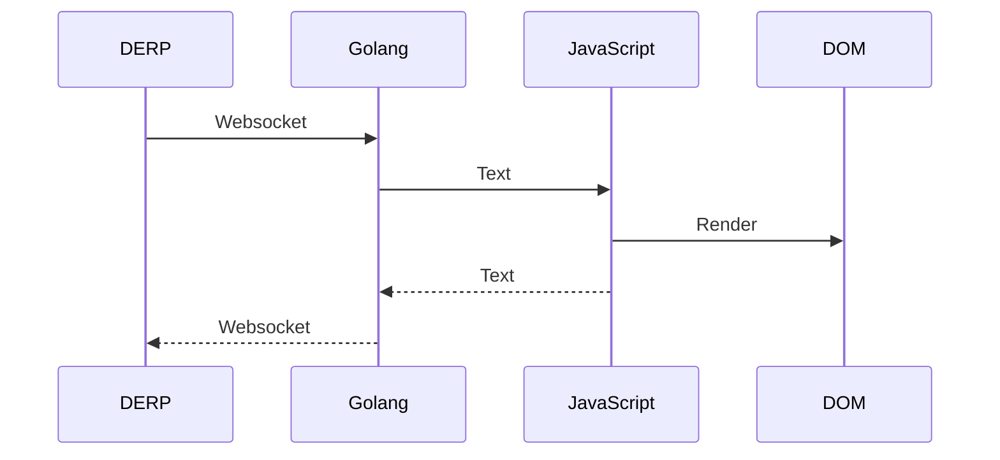
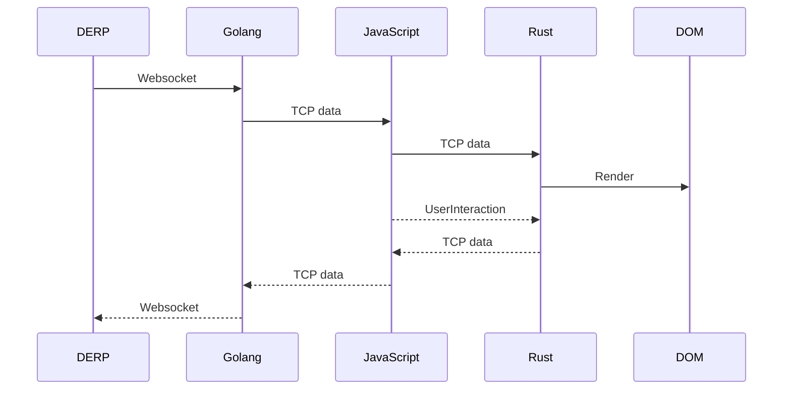
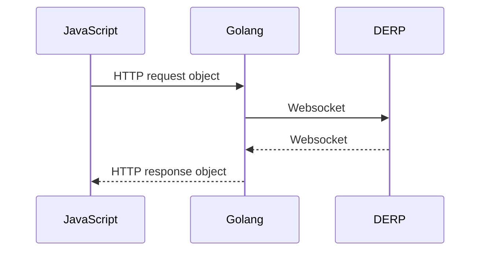

# Headscale Console

[](https://github.com/rickli-cloud/headscale-console/actions/workflows/unstable.yaml)


A web-based interface supporting SSH, VNC and RDP with optional self-service capabilities for [`@juanfont/headscale`](https://github.com/juanfont/headscale).  
Connect to your nodes directly from the browser using WebAssembly.

## Features

- **SSH Console**: Secure terminal access to your nodes.
- **VNC Viewer**: View remote desktops from the browser.
- **RDP Client**: Experimental support for Remote Desktop via WebAssembly, ideal for connecting to Windows nodes—no additional server required.
- **Self Service**: Optional self service tsnet server allowing users to manage their own devices with a opt-in approach. It binds directly into the Headscale GRPC UNIX socket and requires minimal setup & maintenance.

## Deployment

Due to browser CORS restrictions, the console must either be served from the same domain as Headscale, or Headscale must be configured to return a correct `access-control-allow-origin` header - typically handled via a reverse proxy. The Headscale domain can be changed in the console config.

The WASM client is only able to connect to other nodes over a DERP relay via a websocket. Depending on the setup this might not work correctly. Best results are achieved by using the embedded DERP server of headscale.

### Docker

A minimal Docker image is available, featuring a Go web server to serve the static files or to run the self-service API.

#### Image Tags

- `latest`: Latest stable release
- `x.x.x`: Specific release versions
- `x.x.x-pre`: Pre-release versions (potentially unstable)
- `unstable`: Built on every push to the main branch

#### Example Usage

```sh
# static server
docker run -it -p 3000:3000 ghcr.io/rickli-cloud/headscale-console:latest headscale-console serve --help

# self-service tsnet server
# Note: This requires the Headscale Unix socket to be mounted into the container
docker run -it -p 3000:3000 -v ./selfservice-data:/data:rw -v headscale-socket:/var/run/headscale:ro ghcr.io/rickli-cloud/headscale-console:latest headscale-console selfservice --help
```

### Static Hosting

> Everything gets loaded relative to the initial url. It does not matter on what path you serve the app.

Each release includes a downloadable ZIP archive with all required assets for deployment on static web servers (e.g., Nginx, Apache).

## Configuration

> Configuration is completely **optional**

On startup the console tries to load `./config.json`. For the docker image you can mount `/config.json` (or somewhere else defined with the configfile flag).

### Options

Currently still in beta and not yet fully documented. See [`src/lib/store/config.ts`](https://github.com/rickli-cloud/headscale-console/tree/main/src/lib/store/config.ts) for now.

## Build from source

### WASM

Manual build instructions are available in the [`./wasm`](https://github.com/rickli-cloud/headscale-console/tree/main/wasm) directory.  
Refer to the GitHub Actions workflows for the automated build process. WASM binaries are also published as action artifacts.

### Frontend

> Requires WASM

Install dependencies:

```sh
deno install
```

Build the Svelte frontend:

```sh
deno task build
```

> [!TIP]  
> This can also be done inside a Docker container:
>
> ```sh
> docker run -it --rm -v .:/work:rw --workdir /work --entrypoint /bin/sh denoland/deno:latest
> ```

### Docker Image

> Requires a frontend build

```sh
docker build . -t headscale-console:custom
```

### Standalone Executable

> Requires a frontend build

If you do not plan on running the console inside of docker you need to build the executable manually.

```sh
cp frontend.go.tmpl dist/frontend.go
go build main.go
```

> This builds a single executable `main` tailored to the OS and architecture of the build machine.
> If you intend to run it elsewhere, either build it on the target system or adjust the build target accordingly.

## Architecture

> [!NOTE]  
> The TCP connection (handled by Golang) is abstracted into a `IpnRawTcpChannel` on JS side.
> It implements the `RTCDataChannel` interface to allow use with NoVNC & IronRDP but has **nothing to do with WebRTC**.

### SSH

The complete Protocol stack is handled in Golang. Messages are passed thru callbacks from JS to Golang and back.



### VNC

For VNC only the TCP connection is handled in Golang. Protocol layer is handled by NoVNC inside of JS.


### RDP

The TCP connection is handled by Golang. TCP packets are then passed thru JS to the Rust WASM (ironRDP), which is responsible for handling TLS, the RDP protocol & rendering (thru direct DOM access). Due to the passing of data thru multiple languages it gets a little complex and it isn't very efficient, especially as this can only be done thru callbacks & buffering **at every step**.



### Self-Service

Connections to the self-service API are not encrypted with TLS (already uses WSS to relay and Wireguard e2e).


