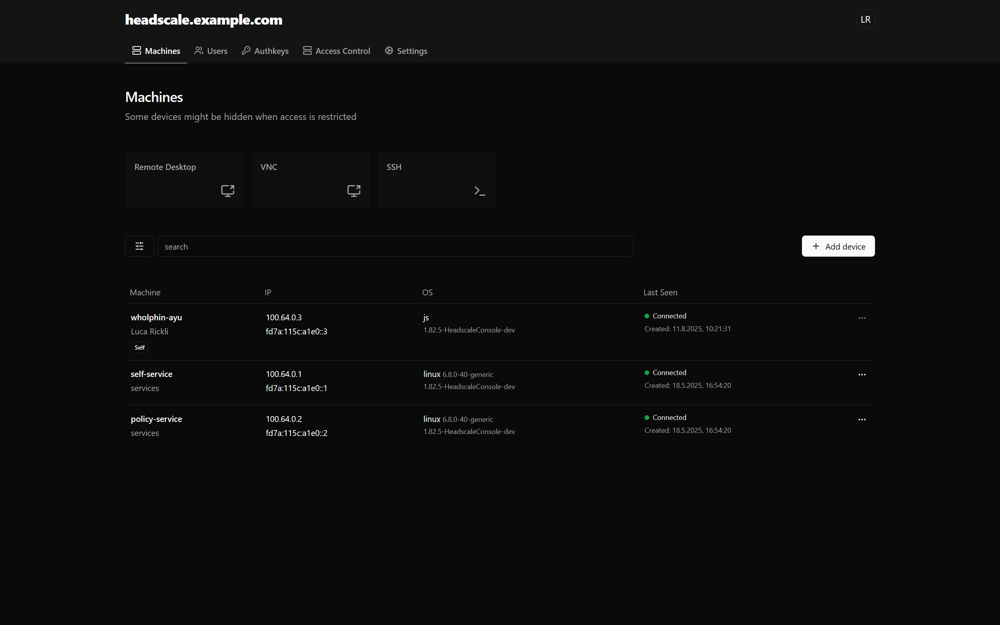

# Headscale Console

[](https://github.com/rickli-cloud/headscale-console/actions/workflows/unstable.yaml)


**A WebAssembly-powered client for connecting to your Headscale nodes via SSH, VNC, or RDP — directly from the comfort of your browser.** Includes an optional self-service integration for seamless device onboarding and management



## Features

- **SSH Console** - Secure terminal access to your nodes
- **VNC Viewer** - Remote desktop viewing in the browser
- **RDP Client** - Secure access to Windows nodes, [inspired by Cloudflare](https://blog.cloudflare.com/browser-based-rdp/), without requiring a additional gateway
- **Self-Service** - Optional [tsnet](https://tailscale.com/kb/1244/tsnet)-based server allowing users to manage their own devices via an opt-in approach. It connects directly to the Headscale gRPC UNIX socket and requires minimal setup and maintenance
- **Stateless** - Integrates into existing infrastructure without the need for a extra database or public API's

## How it works

Headscale uses plain WebSockets for both the control API and DERP relays, something every browser already supports. That means with the help of some WebAssembly the console can piggy-back any protocol (SSH, VNC, RDP, you name it) through a DERP relay, completely bypassing the browser’s usual restrictions.

[Relayed connections (DERP)](https://tailscale.com/kb/1257/connection-types#relayed-connections)

## Deploy

### Notes

#### CORS Restrictions

Headscale does not allow cross origin requests by default.

- Either the console must be served from the same domain as Headscale,
- or Headscale must return the correct `Access-Control-Allow-Origin` headers.

> typically handled via a reverse proxy - see [docker compose example](#docker-compose)

### Docker

A minimal Docker image is available, featuring a Go web server to serve the static files or to run the self-service API.

```sh
docker run -it ghcr.io/rickli-cloud/headscale-console:unstable serve --help
```

```sh
docker run -it ghcr.io/rickli-cloud/headscale-console:unstable selfservice --help
```

#### Image Tags

- `latest`: Latest stable release
- `x.x.x`: Specific release versions
- `x.x.x-pre`: Pre-release versions (potentially unstable)
- `unstable`: Built on every push to the main branch

#### Docker Compose

A full deployment of traefik, headscale, headscale-console & headscale-selfservice can be found in [`docker-compose.yaml`](./docker-compose.yaml).

1. Configure headscale in `config.yaml`

   See [`config-example.yaml`](https://github.com/juanfont/headscale/blob/v0.26.1/config-example.yaml)

2. Configure the environment in `.env`:

   ```sh
   # Required
   HEADSCALE_SERVER_HOSTNAME=headscale.example.com
   HEADSCALE_VERSION=0.26.1

   # Optional
   HEADSCALE_CONSOLE_VERSION=unstable
   TRAEFIK_LISTEN_ADDR=0.0.0.0
   TRAEFIK_VERSION=latest
   ```

3. Create `config.json`

   ```json
   {
     "selfserviceHostname": "self-service"
   }
   ```

   > See [configuration](#configuration) for more

4. Start it all up:

   ```sh
   docker compose up -d
   ```

> [!IMPORTANT]  
> When deploying for production it is recommended to use TLS between traefik and headscale.

### Static Hosting

Each release includes a downloadable ZIP archive with all required assets for deployment on static web servers (e.g., Nginx, Apache).

> All assets are loaded relative to the initial URL, so it does not matter which path you serve the app from.

## Configuration

> Configuration is **completely optional**

On startup the console tries to load `./config.json`. For the docker image you can mount `/config.json` (or somewhere else defined with the configfile flag).

### Options

| Key                 | Type     | Default  | Description                                                                                   |
| ------------------- | -------- | -------- | --------------------------------------------------------------------------------------------- |
| logLevel            | string   | "INFO    | "OFF" \| "ERROR" \| "WARN" \| "INFO" \| "DEBUG" \| "TRACE";                                   |
| controlUrl          | string   | Base URL | The Headscale control url. E.g. `https://headscale.example.com`                               |
| selfserviceHostname | string   |          | Used to identify the self-service node. If undefined all self-service features will be hidden |
| tags                | string[] |          | Only apply when using a authkey                                                               |

## Build from Source

### WebAssembly

Manual instructions are available in [`wasm/`](./wasm). CI workflows also publish prebuilt WASM artifacts.

### Frontend

> Requires WASM builds

Install dependencies:

```sh
deno install
```

Build the frontend:

```sh
deno task build
```

> This could also be done inside a Docker container:
>
> ```sh
> docker run -it --rm -v .:/work:rw --workdir /work --entrypoint /bin/sh denoland/deno:latest
> ```

### Docker Image

> Requires frontend build

```sh
docker build . -t headscale-console:custom
```

### Standalone Executable

> Requires frontend build

If you do not plan on running the console inside of docker you need to build the executable manually:

```sh
cp frontend.go.tmpl dist/frontend.go
go build main.go
```

> This builds a native binary for your current OS and architecture.
> For other platforms, build natively or set appropriate cross-compilation flags.

## Architecture Overview

### Authentication

Authentication via the IdP can occur in a new tab or on a separate device, but the original tab must remain open at all times to receive the authorization callback.


### SSH

Go handles the full protocol stack. JavaScript handles rendering.


### VNC

Go handles the TCP layer. JavaScript (NoVNC) manages the VNC protocol.


### RDP

Go handles the TCP layer. JavaScript passes packets to the Rust-based WASM module, which handles TLS, RDP, and rendering.


### Self-Service API

Reaches out via the derp relay. Traffic is not encrypted with TLS (already protected by the underlying WireGuard tunnel).


> The TCP connection (handled by Golang) is abstracted into a `IpnRawTcpChannel` on JS side.
> It implements the `RTCDataChannel` interface to allow use with NoVNC & IronRDP but has **nothing to do with WebRTC**.

## Feedback & Contributions

Thoughtful feedback is always appreciated, whether it's related to design decisions, usability, or ideas for improvement. Feel free to open an issue to start a conversation. While not every suggestion can be implemented, each one is reviewed and considered with care.

Contributions are welcome! However, to avoid wasted effort, please open an issue first to discuss any significant changes before submitting a pull request. Bug fixes, improvements, and well-scoped features are especially appreciated — just make sure they align with the project's direction.

## License

[MIT License](https://github.com/rickli-cloud/headscale-console/blob/main/LICENSE) - Copyright (c) 2025 rickli-cloud

Made with ❤️ for secure and hassle-free remote access.
