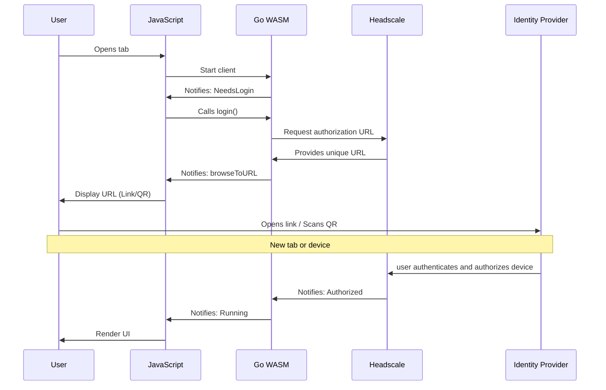
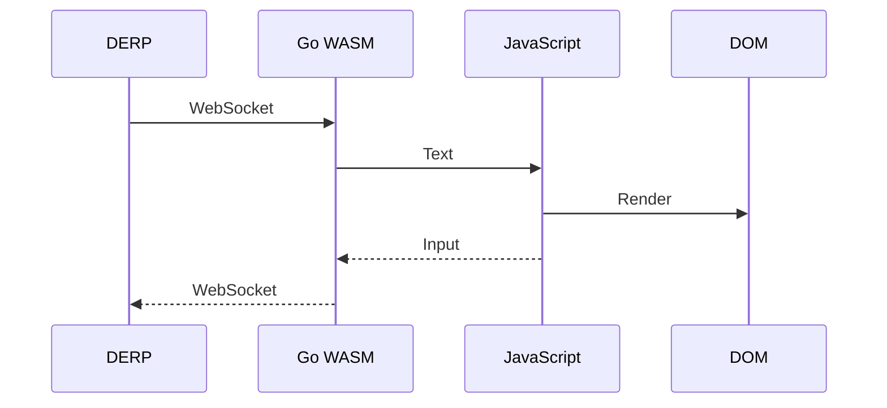
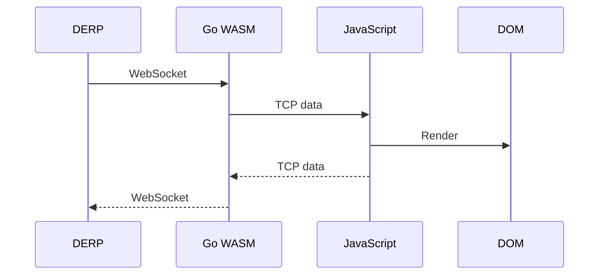
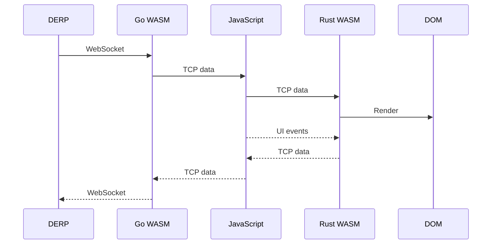
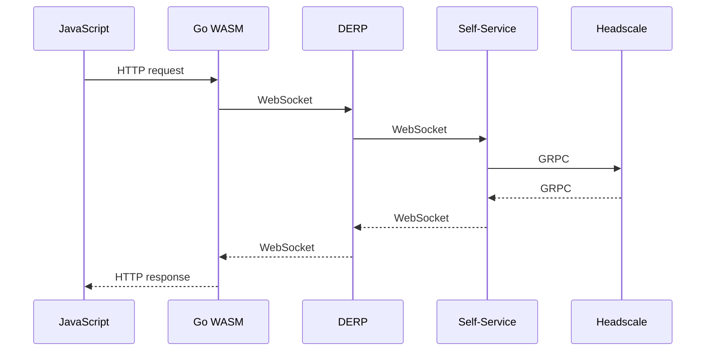

# Architecture Overview

- [Authentication](#authentication)
- [SSH](#ssh)
- [VNC](#vnc)
- [RDP](#rdp)
- [Tsnet Microservices](#tsnet-microservices)

> The TCP connection (handled by Golang) is abstracted into a `IpnRawTcpChannel` on JS side.
> It implements the `RTCDataChannel` interface to allow use with NoVNC & IronRDP but has **nothing to do with WebRTC**.

## Authentication

Authentication via the IdP can occur in a new tab or on a separate device, but the original tab must remain open at all times to receive the authorization callback.

## SSH

Go handles the full protocol stack. JavaScript (xterm) handles rendering.

## VNC

Go handles the TCP layer. JavaScript (NoVNC) manages the VNC protocol.

## RDP

Go handles the TCP layer. JavaScript passes packets to the Rust-based WASM module (IronRDP), which handles TLS, RDP, and rendering.

## Tsnet Microservices

> Used for selfservice & policyservice API

Reaches out via the derp relay. Traffic is not encrypted with TLS (already protected by the underlying WireGuard tunnel).

